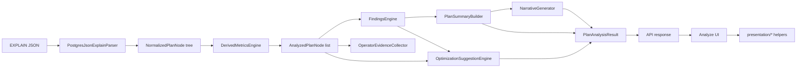
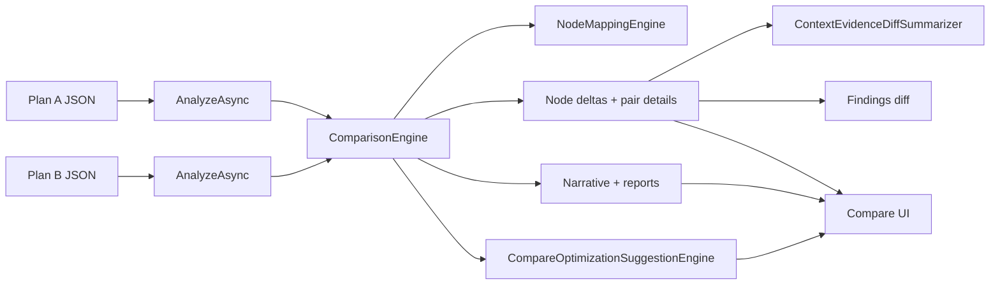
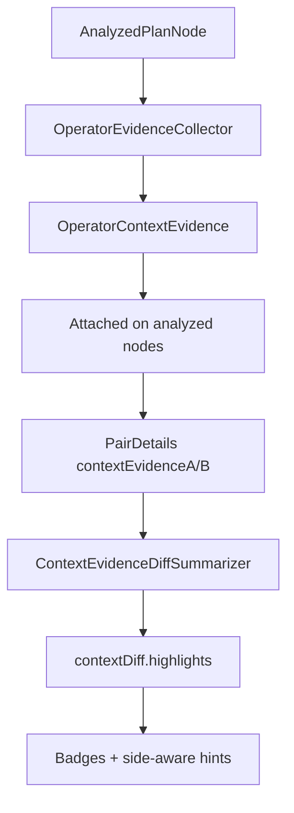
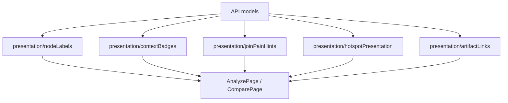

# Architecture Overview

This repository is a disciplined monorepo with:
- `src/backend/`: Backend analysis engine + HTTP API (ASP.NET Core Minimal API)
- `src/frontend/web/`: Interactive forensic UI (React + TypeScript + Vite)
- `src/shared/`: (reserved for future shared DTOs/utilities; optional)

The backend is organized as a modular monolith:
- `PostgresQueryAutopsyTool.Core`
  - Raw plan DTO shapes (Postgres JSON schema)
  - Normalized plan node model
  - Analysis pipeline:
    - Parser (`EXPLAIN (FORMAT JSON)` → `NormalizedPlanNode`; BUFFERS counters from flat node keys and/or nested `Buffers`, plus conservative `Workers` merge onto the parent when a counter is missing there, while still storing each worker line as `PlanWorkerStats` on `NormalizedPlanNode.Workers`)
    - Index posture (`IndexSignalAnalyzer` → `PlanIndexOverview` + bounded `PlanIndexInsight[]` on `PlanAnalysisResult`; feeds Analyze UI and complements findings **P/Q/R/S** without duplicating rule ranking)
    - Derived metrics (`DerivedMetricsEngine` → per-node metrics + shares)
    - Findings (`FindingsEngine` + rules → ranked evidence-based findings)
    - Summary + narrative (`PlanSummaryBuilder`, `NarrativeGenerator`)
    - Optimization suggestions (`OptimizationSuggestionEngine`): consumes findings, `PlanIndexOverview` / `PlanIndexInsight[]`, and per-node `OperatorContextEvidence` (+ worker lists on `NormalizedPlanNode`) to emit ranked, evidence-linked `OptimizationSuggestion` records (categories, action types, cautions, validation steps). **Not** a second findings engine and **not** DDL prescriptions.
    - Compare-scoped suggestions (`CompareOptimizationSuggestionEngine`): runs after `ComparisonEngine` produces findings diff + `IndexComparisonSummary`, yielding `compareOptimizationSuggestions` oriented to “what to try next on plan B given the change.”
  - Comparison engine (heuristic node mapping + deltas + pair details + findings diff)
  - Report generators (Markdown/HTML/JSON) rendered from `PlanAnalysisResult`
- `PostgresQueryAutopsyTool.Api`
  - HTTP endpoints
  - Request validation
  - In-memory persistence for MVP
  - Swagger/OpenAPI

The frontend communicates with the backend via typed API calls:
- Analyze page: paste/upload plan JSON, show narrative + findings + plan visualization
- Compare page: submit two plans, show diff-aware narrative, changed findings, and a synchronized **branch context** strip (see `compareBranchContext` + `CompareBranchStrip`)

## Frontend presentation layer (Phase 12)

The UI uses a small presentation helper layer to keep human-readable labeling consistent and to avoid leaking backend-internal ids into primary UX:
- `src/frontend/web/src/presentation/nodeLabels.ts`: node and pair display labels/titles
- `src/frontend/web/src/presentation/contextBadges.ts`: contextDiff-driven badges for scanability
- `src/frontend/web/src/presentation/comparePresentation.ts`: compare intro copy, summary/coverage phrases, and top-change callouts
- `src/frontend/web/src/presentation/compareBranchContext.ts`: builds the selected-pair **branch view model** (paths, children, mapping/unmatched flags, focal cues) from `PlanComparisonResult` + `matches`
- `src/frontend/web/src/presentation/workerPresentation.ts`: worker summary line + table row shaping for parallel `workers[]` on Analyze selected node
- `src/frontend/web/src/presentation/indexInsightPresentation.ts`: plan overview line, per-node insight cards, compare **access path family** cue (`identity.accessPathFamilyA/B` from API)
- `src/frontend/web/src/presentation/optimizationSuggestionsPresentation.ts`: category/confidence/priority labels + sort order for suggestion cards (Phase 32)
- `src/frontend/web/src/components/CompareBranchStrip.tsx`: compact twin-column UI wired to the same selection state as the navigator and findings diff
- `src/frontend/web/src/components/ClickableRow.tsx` + `ReferenceCopyButton.tsx`: shared row navigation + copy affordances without nested `<button>` markup; `ClickableRow` supports `selected` + `selectedEmphasis` (`fill` vs `accent-bar`) for Compare rows that sit on tinted backgrounds

Raw node ids remain available via optional “debug” details, but primary surfaces prefer human-readable labels.

Join/branch naming (Phase 13):
- Join-family operators get branch-aware labels and subtitles derived from child structure:
  - Hash Join: build (hash child input) vs probe (left child)
  - Nested Loop / Merge Join: outer vs inner (left/right)
- Subtitles optionally include a concise join condition snippet when present.
- Guardrail: when child structure is ambiguous, the UI falls back to left/right rather than fabricating certainty.

Side-attributed join hints (Phase 14):
- Goal: when and only when evidence is explicitly side-scoped, the UI and compare evidence lines can attribute change to a join side.
- Semantics:
  - Hash Join: `contextDiff.hashBuild` is treated as **build-side** evidence (child `Hash` build characteristics).
  - Nested Loop: `contextDiff.nestedLoop.innerSideWaste` (when present) is treated as **inner-side** evidence (propagated from inner scan waste); otherwise only a conservative `inner pressure` hint is emitted from amplification direction.
- Guardrails:
  - No side attribution is emitted for joins unless the underlying evidence model is inherently side-scoped (e.g., Hash build, inner-side waste).
  - Merge Join currently avoids side attribution to prevent guessing.

Narrative/hotspot presentation + query text (Phase 15):
- Backend narrative hotspot strings avoid internal node ids by formatting hotspot references with operator/relation-aware labels.
- Frontend renders hotspots as structured, clickable “inspect next” items derived from `PlanSummary.top*HotspotNodeIds` + the presentation label system.
- Optional query text can be supplied on analyze; it is returned in `PlanAnalysisResult` and surfaced in reports and the Analyze UI as a collapsible “Source query” section.

For MVP, persistence is in-memory only (no database required). Docker Compose runs both services locally.

## Architecture diagrams

### Analysis pipeline

`IndexSignalAnalyzer` (overview + bounded insights) feeds both findings-related UI and `OptimizationSuggestionEngine` in code; the diagram keeps the spine readable.

### Compare pipeline

### Operator evidence propagation

### Presentation layer

Phase 33: **`presentation/artifactLinks.ts`** centralizes query keys (`pair`, `finding`, `indexDiff`, `suggestion`, `node`), `buildCompareDeepLinkSearchParams` / `buildAnalyzeDeepLinkSearchParams`, and `scrollArtifactIntoView` for `data-artifact` targets. Compare syncs a small set of params from selection; Analyze hydrates `?node=` once per `analysisId` after load.

## Data flow

Raw plan JSON
→ `PostgresJsonExplainParser` (normalize)
→ `DerivedMetricsEngine` (annotate)
→ `FindingsEngine` (rules + ranking)
→ `PlanSummaryBuilder` + `NarrativeGenerator`
→ `PlanAnalysisResult` (API response, report input, UI model)

Operator Depth v2 (Phase 9):
- The parser/normalized model also captures operator-specific fields (sort/hash/parallel/waste/cache) when present.
- These fields flow through analysis unchanged and are consumed by:
  - findings evidence (stronger, more concrete explanations)
  - compare pair detail (side-by-side operator specifics)
  - diagnostics and narrative (grounded hints)

Operator evidence propagation (Phase 10):
- `DerivedMetricsEngine` attaches compact `contextEvidence` per analyzed node via `OperatorEvidenceCollector`.
- Context evidence is curated and bounded (nearby descendants only) to avoid flooding payloads.
- Consumers:
  - findings rules can reference contextual evidence to explain parent operators using child/subtree signals
  - compare pair details expose `contextEvidenceA/B` for side-by-side context inspection
  - narrative/reports can cite short contextual hints when present

Context evidence diff summarization (Phase 11):
- `ComparisonEngine` computes `contextDiff` per matched pair from `contextEvidenceA/B`.
- `contextDiff.highlights` is the primary “what changed” signal for:
  - compare selected-pair UX (Context change summary)
  - compare narrative
  - compare markdown report
This keeps summaries bounded and avoids dumping raw context into prose.

## Comparison pipeline

Plan A JSON + Plan B JSON
→ analyze A + analyze B (same pipeline as above)
→ `NodeMappingEngine` (heuristic mapping + confidence)
→ `ComparisonEngine` (per-node deltas, improved/worsened areas, findings diff with **`diffId` (`fd_*`)** + id-based cross-links, **index comparison** via `IndexComparisonAnalyzer` with **`insightDiffId` (`ii_*`)**, **`FindingIndexDiffLinker`** for reciprocal **ids** (legacy index arrays retained), pair **`pairArtifactId` (`pair_*`)**, **corroboration cues**, evidence-based narrative, pair details with **index delta cues**)
→ `PlanComparisonResultV2` (API response, UI model, compare report input; includes `IndexComparison` summary)

Diagnostics mode (optional):
- `POST /api/compare?diagnostics=1` includes bounded candidate + decision diagnostics (winner factors + near-misses).

Compare reports:
- `POST /api/compare/report/json` returns the structured comparison object (optionally with diagnostics).
- `POST /api/compare/report/markdown` returns a human-readable compare report (top pairs + key findings changes + limitations).

