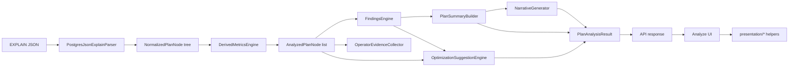
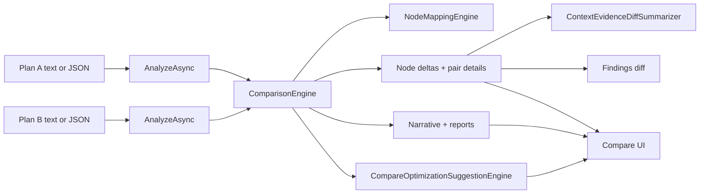
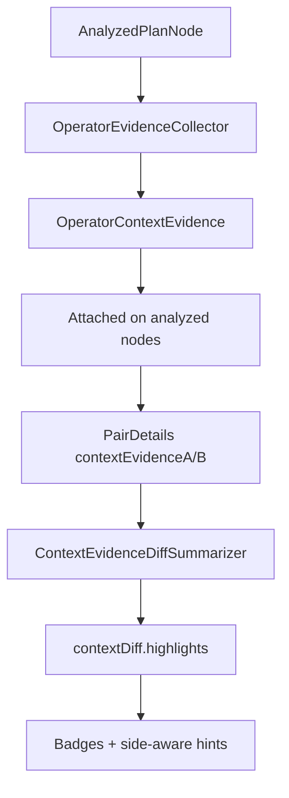
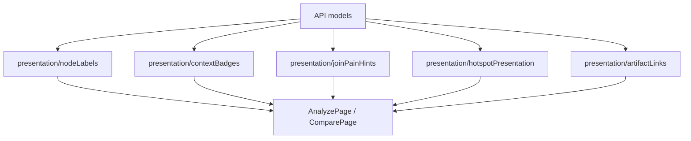

# Architecture Overview

This repository is a disciplined monorepo with:
- `src/backend/`: Backend analysis engine + HTTP API (ASP.NET Core Minimal API)
- `src/frontend/web/`: Interactive forensic UI (React + TypeScript + Vite)
- `src/shared/`: (reserved for future shared DTOs/utilities; optional)

The backend is organized as a modular monolith:
- `PostgresQueryAutopsyTool.Core`
  - Raw plan DTO shapes (Postgres JSON schema)
  - Normalized plan node model
  - Analysis pipeline:
    - Parser (`EXPLAIN (FORMAT JSON)` → `NormalizedPlanNode`; BUFFERS counters from flat node keys and/or nested `Buffers`, plus conservative `Workers` merge onto the parent when a counter is missing there, while still storing each worker line as `PlanWorkerStats` on `NormalizedPlanNode.Workers`)
    - Index posture (`IndexSignalAnalyzer` → `PlanIndexOverview` + bounded `PlanIndexInsight[]` on `PlanAnalysisResult`; feeds Analyze UI and complements findings **P/Q/R/S** without duplicating rule ranking)
    - Derived metrics (`DerivedMetricsEngine` → per-node metrics + shares)
    - Findings (`FindingsEngine` + rules → ranked evidence-based findings)
    - Summary + narrative + **Phase 60–61** **`PlanStory`** (`PlanStoryBuilder` after suggestions: execution overview, work concentration, expense drivers, inspect-first path, **`StoryPropagationBeat[]`** propagation lines each with optional **`focusNodeId`** + human **`anchorLabel`**, index/shape note with operator anchors when an index insight maps to a node). **Phase 61** **`PlanNodeHumanReference`** + **`PlanNodeReferenceBuilder`** derive operator/relation/join-role/sort/aggregate/gather labels (hedged **`QueryCorrespondenceHint`** when source SQL is present); **`NodeLabelFormatter.ShortLabel`** delegates to **`PrimaryLabelCore`** so narrative/bottlenecks avoid raw **`root.*`** paths when evidence exists. Summary + narrative (`PlanSummaryBuilder` builds `PlanSummary` including **Phase 58–59** `Bottlenecks` via internal `PlanBottleneckBuilder` + **`HumanAnchorLabel`** on each insight, `BottleneckClassifier` for **`BottleneckClass`** / **`BottleneckCauseHint`**, **`BottleneckPropagationHelper`** for **`PropagationNote`**; `NarrativeGenerator` uses **`SafePrimary`** for hotspot lists; `OperatorNarrativeHelper` + selected-node interpretation include optional query hints; `PlanNodeInterpretationAugmentor` runs after summary with query text)
    - Optimization suggestions (`OptimizationSuggestionEngine`): consumes findings, `PlanIndexOverview` / `PlanIndexInsight[]`, and per-node `OperatorContextEvidence` (+ worker lists on `NormalizedPlanNode`) to emit ranked, evidence-linked `OptimizationSuggestion` records (categories, action types, **`OptimizationSuggestionFamily`**, **`RecommendedNextAction`**, **`WhyItMatters`**, optional **`TargetDisplayLabel`**, **`IsGroupedCluster`**, cautions, validation steps). Copy is **human-readable** in titles/summaries; raw finding snippets remain in **details**/**rationale**. Overlapping **statistics** findings consolidate conservatively into one grouped card. **Not** a second findings engine and **not** DDL prescriptions.
    - Compare-scoped suggestions (`CompareOptimizationSuggestionEngine`): runs after `ComparisonEngine` produces findings diff + `IndexComparisonSummary`, yielding `compareOptimizationSuggestions` oriented to “what to try next on plan B given the change,” using the same extended suggestion model and **`NodeLabelFormatter`**-style labels for plan B targets.
  - Comparison engine (heuristic node mapping + deltas + pair details + findings diff)
  - Report generators (Markdown/HTML/JSON) rendered from `PlanAnalysisResult`
- `PostgresQueryAutopsyTool.Api`
  - HTTP endpoints
  - Request validation
  - **SQLite artifact persistence** (`IArtifactPersistenceStore` / `SqliteArtifactStore`): full JSON snapshots for **`PlanAnalysisResult`** and **`PlanComparisonResultV2`** (opaque ids, optional TTL / max-row retention). **Phase 49:** writes stamp **`ArtifactSchemaVersion`** / persistence time; reads deserialize with tolerant JSON converters, then **`PersistedArtifactNormalizer`** upgrades legacy payloads and may attach **`alsoKnownAs`** on compare suggestions for deep-link stability; corrupt rows yield **422**, unsupported future schema **409** (rows retained on corrupt reads). **Phase 50:** optional **`E2E:Enabled`** registers **`/api/e2e/seed/*`** helpers plus **`SqliteArtifactStore.UpsertRawJsonForE2E`** for deterministic browser tests only.
  - **Auth (Phase 37–38):** **`AuthIdentityMiddleware`** resolves **`UserIdentity`** (stable **`UserId`**, **group ids**, **`AuthIdentitySource`**) via **`ProxyHeaders`**, legacy **`BearerSubject`**, **`JwtBearer`** (HS256 + **`sub`**), or **`ApiKey`** ( **`SqliteApiKeyPrincipalStore`** — hashed keys). **`IRequestIdentityAccessor`** is the supported read surface for endpoints; **`ArtifactAccessEvaluator`** enforces **`StoredArtifactAccess`**. Optional fixed-window **rate limiting** on analyze/compare POSTs.
  - Swagger/OpenAPI

**Phase 55 (UI):** Dark-theme **design tokens** gain **signal** colors (info/warn/error/denial) and a subtle **ambient** root background; **`workstation-patterns.css`** adds **state banners**, **summary deck**, **sharing** chrome, and **guided** suggestion blocks. Top bar includes a short **workstation** tagline; **`prefers-reduced-motion`** trims animations.

**Phase 56 (UI delivery + parity):** Typography ships via **bundled `@fontsource/*`** (Outfit, IBM Plex Sans, JetBrains Mono) — no runtime **Google Fonts** dependency. **`artifactErrorPresentation`** + **`ArtifactErrorBanner`** unify **Analyze** and **Compare** persisted/request error tone/title semantics. **`html[data-visual-regression='1']`** flattens **`#root`** background for Playwright pixels. Workspace **customizer** uses **`pqat-customizer--chrome`** to align with sharing panel framing.

**Phase 57 (visual hardening + meta chrome):** **`e2e-visual`** gains a fourth frame (**403** access denied, **`page.route`**-mocked so CI stays on **`.env.testing`** only). **`pqat-metaPanel`** + **`pqat-authHelpCard`** tie **customizer**, **sharing**, and capture **`
`** surfaces into one utility family; **`ArtifactErrorBanner`** uses tone-specific body kickers (**Policy** / **Notice** / **Error**). Frontend **`npm test`** = **`vitest run`**; **`test:watch`** for local dev. CI **`frontend`** job calls **`npm test`** without duplicate flags.

**Phase 62 (story refinement + narrative UI):** Backend **`PlanNodeReferenceBuilder`** walks up to the nearest join for **outer/inner** and **probe/build** roles (Hash-on-left vs Hash-on-right heuristic), **`Hash build table (…)`** primary labels, and **`JoinSideRelations`** via **`RelationThroughHashWrapper`**. **`OperatorNarrativeHelper.SymptomNoteIfJoinHeavySide`** adds hash-build-side symptom notes. **`CompareOptimizationSuggestionEngine`** + **`ComparisonStoryBuilder`** tighten human anchor copy. Frontend **`storyPresentation`** (**Plan briefing** / **Change briefing** labels), **`planReferencePresentation.humanNodeAnchorFromPlan`**, **`workstation-patterns.css`** story **lanes** + bottleneck **triage** cards, **`TechnicalIdCollapsible`**, and guide/summary layout updates keep canonical ids secondary.

**Phase 63 (compare briefing + operator readout density):** **`OperatorNarrativeHelper.BuildOperatorBriefingLine`** + **`AnalyzedPlanNode.OperatorBriefingLine`** (set in **`PlanNodeInterpretationAugmentor`**) give a single dense **label · role · pressure** line aligned with **`PlanNodeHumanReference`**. **`PlanNodeReferenceBuilder`** extends **`JoinFamilyTypeLooksBinary`** / **`FormatJoinSideRole`** for **semi/anti** join variants (conservative existence/anti wording; hash-style semi/anti still use probe/build heuristics). **`ComparisonStoryBuilder`** consumes **`BottleneckComparisonBrief`** for a regression+unchanged-class beat, adds **severe-findings delta** beats, and rewrites several beats for engineer walkthrough tone; **`ComparisonEngine.BuildNarrative`**, **`FormatPairEvidence`**, and **`FindingIndexDiffLinker`** drop rule-id–first / backtick-heavy phrasing where practical. Frontend **`briefingReadoutPresentation`**, **`pqat-operatorBriefing`**, and pair briefing grid on **`CompareSelectedPairPanel`**.

**Phase 64 (forensic briefing refinement):** **`PlanBottleneckBriefingOverlay`** copies **`OperatorBriefingLine`** onto **`PlanBottleneckInsight`** after augment (see **`PlanAnalysisService`**). **`HashJoinProbeBuildIndices`** tightens probe/build when **both** direct children are **`Hash`** (smaller row magnitude → build) or when **neither** is direct **`Hash`** but a **`Hash`** appears under a join child within shallow depth **without** piercing nested join roots; ambiguous cases label **probe/build unclear—defaulting to child order**. **`ComparisonStoryBeat.BeatBriefing`** surfaces plan B’s briefing on the primary regression beat (JSON **`beatBriefing`**). **`OperatorNarrativeHelper`** deepens **sort / gather / partial·final aggregate** bottleneck copy. **`PlanStoryBuilder`** **Inspect first** steps are more tactical; fixtures **`gather_merge_partial_agg`**, **`hash_join_nested_build_hash`** back tests. Frontend **`pqat-bottleneckCard__briefing`**, **`pqat-changeStoryBeat__briefing`**.

**Phase 65 (theme system + cross-theme polish):** Frontend **`theme/`** (`THEME_STORAGE_KEY` **`pqat_theme_v1`**, preference **`system` | `dark` | `light`**, default **`system`**) drives **`html[data-theme-preference]`** and effective **`html[data-theme="dark"|"light"]`** plus **`documentElement.style.colorScheme`**. **`useThemePreference`** subscribes to **`prefers-color-scheme`** when preference is **system** (no one-shot snapshot). An inline boot script in **`index.html`** applies the same key before first paint to limit FOUC. **`ThemeAppearanceSelect`** lives in the app **top bar**. Light and dark each have intentional token sets in **`index.css`** (not a single inversion); story lanes, banners, graph chrome, and chips use shared variables where practical. **`PersistedArtifactNormalizer`** (**Phase 65**): after loading persisted analyze/compare JSON, re-attaches **`PlanBottleneckBriefingOverlay.AttachOperatorBriefings`** when plan nodes still carry **`operatorBriefingLine`** so older snapshots regain bottleneck **Briefing** without re-analysis. Playwright **`e2e-visual`** locks **`localStorage`** + **`data-theme`** to **dark** alongside **`data-visual-regression`**. Vitest **`src/theme/theme.test.ts`** covers resolver + hook persistence/DOM attributes; **`useThemePreference`** guards missing **`matchMedia`** (jsdom).

**Phase 66 (theme hardening + storytelling audit):** **`data-effective-theme`** mirrors the resolved skin for tests. **`--pqat-tint-*`** / **`--pqat-story-edge-*`** tokens replace stray hex in **`workstation-patterns.css`**, **`CompareTopChangesPanel`**, and **`AnalyzePlanGraphCore`**. Light **story lanes** get clearer borders; **`--code-bg`** nudges cooler for mono readouts. **`App`** loads **`fetchAppConfig`** once; when **`authEnabled`**, **`useThemePreference({ serverSyncEnabled })`** hydrates from **`GET /api/me/preferences/appearance_theme_v1`** (JSON string value) and debounces **`PUT`** after changes — same pattern as workspace layout keys. **`themePresentation`** supplies labels + **`aria-describedby`** for **System** mode. **`e2e/theme-appearance.spec.ts`** (in **`e2e-smoke`**) asserts DOM theme state, reload persistence, and distinct top-bar computed colors. **`ComparisonEngine`** index/finding corroboration line copy tightened.

**Phase 67 (nested-loop / rewrite continuity):** **`PlanNodeReferenceBuilder.PairRegionContinuityHint`** + optional continuity suffix on **`PairHumanLabel`** feed **`NodePairDetail.RegionContinuityHint`** and compare story beats when **`MatchConfidence ≥ Medium`**. **`OperatorNarrativeHelper`** stresses **nested-loop inner** repetition (loops × inner access path). **`CompareOptimizationSuggestionEngine`** adds a rewrite **operator-shape** observation when continuity hints exist. Frontend surfaces **`regionContinuityHint`** on **selected pair** and **What changed most**. Unit fixtures **`nl_inner_seq_heavy`**, **`rewrite_nl_orders_lineitems`**, **`rewrite_hash_orders_lineitems`** exercise narrative + compare paths.

**Phase 68 (scan / order rewrite continuity):** **`PairRegionContinuityHint`** adds **sort-under-seq → ordered index** wording (parent **Sort** on A + token overlap between **sort key** and plan B **index cond** / **presorted key**), optional **Sort → index scan** continuity when mapped, and sharper **seq → index** copy (“broad scan” / residual cost). **`NodeMappingEngine.Score`** adds **`accessRewrite`** bonus for **same-relation Seq Scan ↔ index-backed scan** pairs so continuity is not suppressed as Low-confidence noise. **`ComparisonStoryBuilder`** uses continuity on **top worsened** as well as improved runtime beats; **`CompareOptimizationSuggestionEngine.RegionContinuityFollowUpSentence`** tailors the second sentence. Frontend **`compareContinuityPresentation.pairContinuitySectionTitle`** labels readouts. Fixtures **`rewrite_access_*_shipments`**, **`rewrite_sort_seq_shipments`**, **`rewrite_index_ordered_shipments`** back tests.

**Phase 69 (richer rewrite continuity + summary cue):** **`ClassifyOrderingContinuity`** prefers **column-name alignment** between parsed **sort keys** and **index cond** / **presorted key** (identifier-boundary match) for **Strong** ordering evidence; **token overlap** yields a **Weak** hedged line. Same-relation scan hints cover **seq ↔ bitmap heap**, **bitmap ↔ index / index-only**, **index ↔ index-only**, with residual-cost framing. **`CompareContinuitySummaryCue.FromHint`** maps long hints to short strings; **`NodePairDetail.RegionContinuitySummaryCue`** is serialized as **`regionContinuitySummaryCue`**. **`NodeMappingEngine.accessRewrite`** bonus extends to the **scan-family** pairs above. Compare **Change briefing** shows the cue chip when the selected pair (or first focused story beat) carries a cue. Fixtures **`rewrite_access_bitmap_shipments`**, **`rewrite_access_idxonly_shipments`** (+ `.sql`) augment tests.

**Phase 70 (continuity confidence + structured cues):** **`TryPairRegionContinuity`** returns **`RegionContinuityData`** (**`KindKey`**, **`ContinuityOutcome`**, full **`Hint`**). **`CompareContinuitySummaryCue.FromContinuity`** maps **kind + outcome** to compact chips (regression paths are **not** phrased as wins). **ORDER BY** text in **`QueryText`** acts as a **conservative tie-breaker** when planner JSON is opaque. **Aggregate** continuity covers **partial vs finalize** when **GROUP BY** keys align. **`NodePairDetail.continuityKindKey`** mirrors **`KindKey`**. Playwright smoke asserts the continuity chip in a real Compare POST.

**Phase 71 (aggregate/output continuity + query-text grouping):** **`TryPairRegionContinuity`** adds **Gather / Gather Merge** ↔ **non-partial aggregate** branches, **GROUP BY** substring bridging for mismatched **Group Key** text, and **time_bucket**-aware hedges when SQL and keys suggest bucketing. **`NodeMappingEngine`** classifies **Gather** as its own **operator family** (vs **Aggregate**) with **near-family** similarity and a **`gatherAggRewrite`** score bump so parallel stacks map to single-node aggregates for compare. **`ComparisonStoryBuilder`** appends a short **grouped-output residual** tail when continuity hints reference **grouped-output** / **output-shaping** / **partial vs finalize** / **gather-merge**. **`CompareOptimizationSuggestionEngine`** tail lines cover grouped-output and thin JSON + **ORDER BY** query assist. Frontend **`pairContinuitySectionTitle`** adds **Grouped output · same region**. E2E bundles **`rewrite_access_idx_shipments`** / **`rewrite_access_bitmap_shipments`** for a **regression continuity** smoke test.

**Phase 72 (analyze corpus sweep + clipboard reliability):** **`PostgresJsonAnalyzeFixtureSweepTests`** validates every **`fixtures/postgres-json/*.json`** (top-level) through **`PlanAnalysisService`** with structural checks on **`PlanStory`**, summaries, findings, and suggestions. **`cumulative_group_by.json`** is repaired to pure JSON and covered by a targeted grouped-output test. Frontend **`copyToClipboard`**, **`useCopyFeedback`**, **`ClickableRow`** click guards, and **`nodeReferences`** copy payloads support dependable **Copy** actions on **http** and **https**; Playwright (**Phase 77**) asserts **Analyze → Copy reference** via captured **`writeText`** payload (not **`readText()`** in page).

**Phase 73 (CI validity + copy-path ergonomics):** GitHub Actions **`.github/workflows/ci.yml`** quotes **`run:`** values where shell hints include **`#`** or plain **`Local: …`** (YAML **`#`** comments and **`:`** mapping syntax otherwise break parsing). **`e2e-playwright`** keeps **Docker Compose** **`playwright`** on **`e2e-smoke`** (includes **`persisted-flows`** clipboard regression). Frontend **`npm run test:e2e:copy`** runs that spec only; **`shareAppUrl.appUrlForPath`** centralizes **origin + pathname** for copy-link actions (Analyze summary, selected node, Compare deep link).

**Phase 74 (fixture sweep ergonomics + workflow guard + Make paths):** **`AnalyzeFixtureCorpus`** + **`AnalyzeFixtureStructuralAssertions`** in **`tests/.../Support/`** centralize postgres-json discovery and structural post-analyze checks; **`AnalyzeFixtureCorpusTests`** guards the directory path. **`scripts/lint-workflows.sh`** + **`.github/workflows/workflow-lint.yml`** (**actionlint**, path-scoped on workflow changes) plus **`.actionlint.yaml`**. **`Makefile`** documents **`repo-health`**, **`verify`**, **`verify-docker`**, **`test-backend-docker`**, **`test-e2e-copy`**, and **`lint-workflows`**.

**Phase 75 (visual regression stabilization):** Playwright **`e2e-visual`** replaces brittle **full-page** Analyze/Compare baselines with **element screenshots** tied to **`aria-label`** story regions (**`Analysis summary`**, **`Analyze workspace`**, **`Findings list`**, **`Compare summary`**, **`Compare navigator`**, **`Compare pair inspector`**). Error paths snapshot **`analyze-page-error`** only. Helpers in **`e2e/visual/visualTestHelpers.ts`**.

**Phase 76 (visual reproducibility + graph settle):** **`@playwright/test`** is pinned to **1.52.0** (matches **`mcr.microsoft.com/playwright:v1.52.0-jammy`** in **`docker-compose.yml`**). **`waitForGraphLayoutSettled`** (viewport size poll + double **`requestAnimationFrame`**) runs before Analyze workspace screenshots. **actionlint** pinned to **v1.7.7** (CI + Docker script). Workflow lint is a dedicated **`workflow-lint.yml`** with **`paths`** filters. **`src/frontend/web/.dockerignore`** keeps **`docker compose build web`** reproducible (host **`node_modules`** must not overwrite **`npm ci`**).

**Phase 77 (CI workflow-lint + clipboard E2E):** **`workflow-lint.yml`** invokes **`./scripts/lint-workflows.sh`** (Docker **`rhysd/actionlint:1.7.7`**) instead of an unresolvable **`uses: rhysd/actionlint@…`** action. **`e2e-smoke`** copy regression uses **`installE2eClipboardCapture`** so tests read the **`writeText`** payload from **`window`**, not **`navigator.clipboard.readText()`** (unreliable in headless CI).

**Phase 78 (docs front door + CI parity):** Root **`README.md`** links hosted docs at **`https://sempervent.github.io/postgres-query-autopsy-tool/`** and points contributors to **`docs/contributing.md` → “CI parity (verified commands)”**; stale **`actionlint:latest`** wording in historical log entries corrected to the pinned image.

**Phase 79 (immutable images + Docker frontend verify):** Multi-arch **index digests** pin **Playwright** (**`docker-compose.yml`**), **web** build/runtime (**`node:20-alpine`**, **`nginx:alpine`**), **API** build/runtime (**.NET 8** SDK/ASP.NET), **`Makefile`** **`test-backend-docker`**, and **`scripts/verify-frontend-docker.sh`**. **`make verify-frontend-docker`** runs the **CI-shaped** frontend script in that Node image; **`make verify-docker`** chains it with Docker backend tests. **`src/backend/.dockerignore`** drops **`bin/`** / **`obj/`** from the API build context. (**Phase 81** tightens the script to **`fixtures:check`** + full-repo mount — see below.)

**Phase 80 (verification path + fallbacks):** **`scripts/lint-workflows.sh`** defaults to digest-pinned **actionlint** Docker image; **`ACTIONLINT_BOOTSTRAP=1`** downloads official **v1.7.7** binary to **`.cache/pqat-actionlint/`** when Docker is unavailable (**Phase 81** adds **SHA256** verification against the release **checksums** file). **`make repo-health-docker`** = lint + **`verify-frontend-docker`**. **CI** **`frontend`** job pins **Node 20.18.0** (with **`.nvmrc`** / **Volta**). Contributor docs add a **verification tiers** table.

**Phase 81 (front door + trust signals):** Root **`README.md`** is the primary project front door: compact verification table, Docker quick-check snippet, shield row (**CI**, **workflow lint**, **GitHub Pages** docs, **MIT**, **.NET 8**, **Node 20.18**). **`docs/index.md`** repeats the same shields so **MkDocs** / Pages match GitHub. **`ACTIONLINT_BOOTSTRAP`** now **SHA256-verifies** the tarball against upstream **`actionlint_${ver}_checksums.txt`**. **`scripts/verify-frontend-docker.sh`** bind-mounts the **full repo** and runs **`npm run fixtures:check`** before **`npm test`** + **`npm run build`**, matching **`ci.yml`** **`frontend`**. **`scripts/shellcheck-scripts.sh`** + **`make shellcheck-scripts`** (optional **shellcheck** on PATH). **`.github/workflows/ci.yml`** **`setup-node`** adds **`cache: npm`** (**`package-lock.json`** path). Contributor docs: **badge sync**, **re-pinning** playbook, **npm audit** triage note.

**Browser E2E (Phase 50–57):** Playwright smoke exercises persisted **`?analysis=`** / **`?comparison=`**, **`?node=`**, **`?suggestion=`** alias resolution, **422/409** error UI, and staged Compare pair hydration. **Phase 52:** **`e2e-auth-api-key`**. **Phase 53:** **`e2e-auth-jwt`**. **Phase 54:** **`e2e-auth-proxy`**. **Phase 56–57:** **`e2e-visual`** — canonical pixel checks under **`e2e/visual/`**. **Phase 75:** **`e2e-visual`** uses **region screenshots** (Analyze summary/workspace/findings; Compare summary/navigator/pair; error banner only) so layout growth does not invalidate giant full-page baselines. **Compose:** **`api` + `web`** by default; **`--profile testing`** **`playwright`**; **`PQAT_E2E_ENABLED`** gates **`/api/e2e/seed/*`**. See [Contributing](contributing.md#browser-e2e-playwright).

The frontend communicates with the backend via typed API calls:
- Analyze page: paste/upload plan JSON; **Phase 49** maps **422/409** artifact GET failures to explicit UI copy (corrupt vs unsupported schema vs not found vs access denied). **Phase 39+42** lay out results as a **workspace**: graph/text tree + **Plan guide** rail (`AnalyzePage`, **three-tier** layout via **`useWorkspaceLayoutTier`**: narrow &lt;900px stacks, **medium** 900–1319px keeps side-by-side graph+guide with tuned column ratios, **wide** ≥1320px emphasizes the investigation surface), then lower band for findings + suggestions + selected node; the graph is **`AnalyzePlanGraphLazy`** wrapping **`AnalyzePlanGraphCore`** (React Flow) in a **lazy chunk** with **`PlanGraphSkeleton`** while **Text** mode avoids loading that chunk until **Graph** is chosen (**idle** + **Graph** control **hover/focus** prefetch). **Phase 42** widens the app shell (fluid **`max-width`** in `App.css`). **Phase 43** applies **`workstation.css`** + design tokens. **Phase 44** adds **`workstation-patterns.css`**, **`React.lazy`** for **`AnalyzePage`**, and defers **`AnalyzeWorkspaceCustomizerInner`** until the customizer **`
`** opens (with **`RouteFallback`** / **`CustomizerBodyFallback`** loading UI). **Phase 45** adds **lower-band** lazy chunks (**findings** / **suggestions** / **selected node**), **`HeavyPanelShell`** + **`LowerBandPanelSkeleton`**, **`VirtualizedListColumn`** for long findings and suggestion lists, and **`AnalyzeSelectedNodeHeavySections`** lazy-loaded under the selected-node header. **Phase 48** keeps **family group headers** inside the virtualized optimization list via **flattened rows** + **`getItemSize`**, and normalizes **older persisted** suggestion JSON for display.
- Compare page: submit two plans, show diff-aware narrative, changed findings, and a synchronized **branch context** strip (see `compareBranchContext` + `CompareBranchStrip`). **`?suggestion=`** deep links resolve through **`alsoKnownAs`** (Phase 49 server aliases + client **`resolveCompareSuggestionParamToCanonicalId`**) so legacy bookmarked ids still highlight the canonical row. **Phase 41** decomposes the page into `components/compare/*`, adds **`compareWorkspace/`** (layout model + **`useCompareWorkspaceLayout`**, localStorage + optional **`compare_workspace_v1`** user preference), and **`workspaceLayout/reorder.ts`** shared with Analyze for neighbor swaps. **Phase 42** applies the same **layout tiers** to summary + main grids and uses **`components/workspace/WorkspaceSortableOrderList`** (**@dnd-kit** drag + **Up/Down** fallback). **Phase 43** aligns Compare surfaces with **`pqat-*`**. **Phase 44** refines capture/advanced blocks into shared patterns, **`React.lazy`** for **`ComparePage`**, and **`CompareWorkspaceCustomizerInner`** split for on-open loading of DnD lists. **Phase 45** windowizes long **findings diff** lists in **`CompareNavigatorPanel`** with the same **`VirtualizedListColumn`** helper (thresholded; small diffs stay a plain list). **Phase 46** lazy-loads **`CompareSelectedPairHeavySections`** (access path, corroboration, join/context summaries, evidence grids, metric deltas, pair findings, matcher diagnostics) under **`CompareSelectedPairPanel`** with a **`Suspense`** skeleton (**`pqat-pairHeavySkeleton`**), while the pair title, copy actions, optional compare next-step, and confidence line stay eager; **`ComparePage`** shrinks slightly as heavy pair UI moves to its own chunk. **Phase 48** adds **`prefetchCompareSelectedPairHeavySections()`** (coalesced dynamic `import`) on **`ClickableRow` `onPointerIntent`** from navigator pair rows, findings diff rows, **What changed most**, **Branch context** mapped rows, **`requestIdleCallback`** after a comparison loads, and **Focus plan B** hover/focus on summary suggestions—mirroring Analyze graph **idle/hover** prefetch—plus a softer skeleton entry animation.

## Frontend presentation layer (Phase 12)

The UI uses a small presentation helper layer to keep human-readable labeling consistent and to avoid leaking backend-internal ids into primary UX:
- `src/frontend/web/src/presentation/nodeLabels.ts`: node and pair display labels/titles (sort labels align with backend “feed relation + sort key” when `byId` is present)
- `src/frontend/web/src/presentation/planReferencePresentation.ts`: normalize **Phase 61** story beats vs legacy string arrays; **Phase 62** **`humanNodeAnchorFromPlan`** for compare focus labels without raw paths
- `src/frontend/web/src/presentation/briefingReadoutPresentation.ts` (**Phase 63**): trims **`operatorBriefingLine`** for display and shared **Briefing** strip copy in Analyze/Compare readouts
- `src/frontend/web/src/presentation/contextBadges.ts`: contextDiff-driven badges for scanability
- `src/frontend/web/src/presentation/comparePresentation.ts`: compare intro copy, summary/coverage phrases, and top-change callouts
- `src/frontend/web/src/presentation/compareBranchContext.ts`: builds the selected-pair **branch view model** (paths, children, mapping/unmatched flags, focal cues) from `PlanComparisonResult` + `matches`
- `src/frontend/web/src/presentation/workerPresentation.ts`: worker summary line + table row shaping for parallel `workers[]` on Analyze selected node
- `src/frontend/web/src/presentation/indexInsightPresentation.ts`: plan overview line, per-node insight cards, compare **access path family** cue (`identity.accessPathFamilyA/B` from API)
- `src/frontend/web/src/presentation/optimizationSuggestionsPresentation.ts`: family + category labels, **readable** confidence/priority fragments (no `Label: value` soup in primary UI), metadata sentence helper, **grouping** helper for long lists, **flattened virtual rows** (header + card) + per-row size hints for **`VirtualizedListColumn`**, **display normalization** for older persisted payloads missing Phase 47 fields, sort order for suggestions (Phase 32 + Phase 47 + Phase 48)
- `src/frontend/web/src/presentation/bottleneckPresentation.ts` (Phase 58–59): short labels for bottleneck **`kind`**, human phrases for **`bottleneckClass`** / **`causeHint`**, stable sort by **`rank`** for the Plan guide **Main bottlenecks** block; suggestion cards resolve **`relatedBottleneckInsightIds`** to those rows when present
- `src/frontend/web/src/components/CompareBranchStrip.tsx`: compact twin-column UI wired to the same selection state as the navigator and findings diff
- `src/frontend/web/src/components/ClickableRow.tsx` + `ReferenceCopyButton.tsx`: shared row navigation + copy affordances without nested `<button>` markup; `ClickableRow` supports `selected` + `selectedEmphasis` (`fill` vs `accent-bar`) for Compare rows that sit on tinted backgrounds, optional **`onPointerIntent`** (mouse enter + focus) for lightweight prefetch hooks (Phase 48 Compare pair heavy chunk), and **Phase 72** ignores clicks from nested interactive elements / **`data-pqat-row-no-activate`**
- `src/frontend/web/src/presentation/copyToClipboard.ts` + **`useCopyFeedback.ts`**: clipboard write with **execCommand** fallback and user-visible failure copy (**Phase 72**)
- **`shareAppUrl.ts`**: **`appUrlForPath`** for **origin + pathname** on copy-link actions (**Phase 73**)

Raw node ids remain available via optional “debug” details, but primary surfaces prefer human-readable labels.

Join/branch naming (Phase 13):
- Join-family operators get branch-aware labels and subtitles derived from child structure:
  - Hash Join: build (hash child input) vs probe (left child)
  - Nested Loop / Merge Join: outer vs inner (left/right)
- Subtitles optionally include a concise join condition snippet when present.
- Guardrail: when child structure is ambiguous, the UI falls back to left/right rather than fabricating certainty.

Side-attributed join hints (Phase 14):
- Goal: when and only when evidence is explicitly side-scoped, the UI and compare evidence lines can attribute change to a join side.
- Semantics:
  - Hash Join: `contextDiff.hashBuild` is treated as **build-side** evidence (child `Hash` build characteristics).
  - Nested Loop: `contextDiff.nestedLoop.innerSideWaste` (when present) is treated as **inner-side** evidence (propagated from inner scan waste); otherwise only a conservative `inner pressure` hint is emitted from amplification direction.
- Guardrails:
  - No side attribution is emitted for joins unless the underlying evidence model is inherently side-scoped (e.g., Hash build, inner-side waste).
  - Merge Join currently avoids side attribution to prevent guessing.

Narrative/hotspot presentation + query text (Phase 15):
- Backend narrative hotspot strings avoid internal node ids by formatting hotspot references with operator/relation-aware labels.
- Frontend renders hotspots as structured, clickable “inspect next” items derived from `PlanSummary.top*HotspotNodeIds` + the presentation label system.
- Optional query text can be supplied on analyze; it is returned in `PlanAnalysisResult` and surfaced in reports and the Analyze UI as a collapsible “Source query” section.

Analyze and Compare share-links are backed by a **local SQLite file** (configurable path; Docker mounts a volume on `/app/data` by default). **Phase 37** adds optional **auth + per-artifact ACL** (`StoredArtifactAccess`: owner, scope, groups, link flag) while keeping **non-auth mode** as the default (capability URLs, no identity). See [Deployment & auth](deployment-auth.md). Docker Compose runs both services locally with a named volume so ids can survive container restarts when the volume is kept.

## Architecture diagrams

### Analysis pipeline

`IndexSignalAnalyzer` (overview + bounded insights) feeds both findings-related UI and `OptimizationSuggestionEngine` in code; the diagram keeps the spine readable.

### Compare pipeline

Phase 36: each analyze half can carry optional **`queryTextA`/`queryTextB`**, **`explainMetadataA`/`explainMetadataB`**, and **`PlanInputNormalizationInfo`** per side; **`POST /api/compare`** persists **`PlanComparisonResultV2`** and returns **`comparisonId`**; **`GET /api/comparisons/{id}`** reloads the snapshot.

### Operator evidence propagation

### Presentation layer

Phase 33: **`presentation/artifactLinks.ts`** centralizes query keys (`pair`, `finding`, `indexDiff`, `suggestion`, **`analysis`**, **`comparison`**, `node`), `buildCompareDeepLinkSearchParams` / `buildAnalyzeDeepLinkSearchParams`, and `scrollArtifactIntoView` for `data-artifact` targets. Compare syncs a small set of params from selection.

Phase 34: optional **`ExplainCaptureMetadata`** on analyze request/response; **`PlannerCostAnalyzer`** fills **`PlanSummary.PlannerCosts`** from parsed nodes; **`presentation/explainCommandBuilder.ts`** + **`explainMetadataPresentation.ts`** support the Analyze “Suggested EXPLAIN” UI. Analyze **`?node=`** is kept in sync with selection (deduped `replace` updates).

Phase 35: **`PlanInputNormalizer`** (Core) + **`PlanInputNormalizationInfo`** on **`PlanAnalysisResult`**; API prefers **`planText`** for analyze; shareable **`?analysis=`** + **`?node=`** URL model, **Copy share link**, inline normalization status.

Phase 36: **SQLite** artifact store for analyses and comparisons; **`GET /api/analyses/{id}`** / **`GET /api/comparisons/{id}`** read durable JSON payloads; optional **`Storage:ArtifactTtlHours`** and **`Storage:MaxArtifactRows`**; Compare **`planAText`/`planBText`**, per-side query text + **`ExplainCaptureMetadata`**, UI **Plan capture / EXPLAIN context** (A vs B), **`?comparison=`** + **Copy share link** parity with Analyze.

Phase 38: **JWT** and **API key** identity modes ( **`JwtBearer`**, **`ApiKey`** ) with stable **owner ids**; legacy **`BearerSubject`** unchanged; **`GET /api/config`** exposes **`authIdentityKind`** + **`authHelp`**; optional **`RateLimiting`** on POST endpoints.

Phase 39: **Analyze workspace UX** — narrative, hotspots, top findings, and suggestion **previews** sit in a **Plan guide** rail adjacent to the graph on wide viewports; **compact selection snapshot** mirrors graph/hotspot/finding clicks; full findings and **Selected node** detail remain below with **`
`** for workers, raw JSON, derived metrics, and operator context to reduce vertical noise; graph height is **responsive** (`AnalyzePlanGraph` `graphHeight` prop).

Phase 40: **Analyze decomposition + layout preferences** — **`AnalyzePage`** orchestrates extracted panels under `components/analyze/`; **`analyzeWorkspace/analyzeWorkspaceModel.ts`** defines **`AnalyzeWorkspaceLayoutState`** (visibility, guide section order, lower-band column order, presets); **`useAnalyzeWorkspaceLayout`** persists to **localStorage** and optionally **`/api/me/preferences/analyze_workspace_v1`** when auth + client credentials are present; API adds **`IUserPreferenceStore`** / **`SqliteUserPreferenceStore`** + **`user_preference`** table in the artifact SQLite file. The model is page-keyed and versioned so Compare can reuse the same persistence pattern later.

Phase 41: **Compare workspace parity** — typed **`CompareWorkspaceLayoutState`**, **`useCompareWorkspaceLayout`**, **`components/compare/*`**, and **`compare_workspace_v1`** preference key mirror Analyze’s customization story.

Phase 42: **Workspace density + responsive tiers + richer reorder** — **`useWorkspaceLayoutTier`** (`narrow` / `medium` / `wide` at **900px** and **1320px**) drives Analyze and Compare grids; **`WorkspaceSortableOrderList`** adds handle-based **drag-and-drop** reorder with **Up/Down** keyboard-friendly fallback; expanded **presets** (**Wide graph**, **Reviewer**, **Compact** on Analyze; **Wide pair** / **`wideGraph`** on Compare). Coercion helpers (**`coerceAnalyze*`** / **`coerceCompare*`**) keep stored JSON valid when merging.

Phase 43: **Visual workstation system** — **`index.css`** tokens (**`--surface-*`**, text rungs, elevation, focus ring) and **`workstation.css`** (**`pqat-*`** utilities: panels, buttons, segmented toggles, chips, metric tiles, graph frame, customizer well). **`App.tsx`** uses **`NavLink`** for active route styling; findings use severity **chip** colors; shell **topBar** uses backdrop blur and pill links.

Phase 44: **Patterns + delivery** — **`workstation-patterns.css`** holds dense layout/form/callout primitives (grids, capture stack, navigator pair rows, summary shell, route fallback). **`App.tsx`** lazy-loads **`AnalyzePage`** / **`ComparePage`** with **`Suspense`**; workspace customizers mount **`WorkspaceSortableOrderList`** (**@dnd-kit**) only after **Customize workspace** opens via **`React.lazy`** inner modules. Vitest **`setup.ts`** preloads inner modules so Suspense resolves in jsdom.

## Data flow

Raw pasted `planText` (optional `psql` wrapper / `+` wraps)
→ **`PlanInputNormalizer`** (Phase 35) → JSON string
→ `JsonDocument.Parse` / legacy `plan` body

Raw plan JSON
→ `PostgresJsonExplainParser` (normalize)
→ `DerivedMetricsEngine` (annotate)
→ `FindingsEngine` (rules + ranking)
→ `PlanSummaryBuilder` + `NarrativeGenerator`
→ `PlanAnalysisResult` (API response, report input, UI model)

Operator Depth v2 (Phase 9):
- The parser/normalized model also captures operator-specific fields (sort/hash/parallel/waste/cache) when present.
- These fields flow through analysis unchanged and are consumed by:
  - findings evidence (stronger, more concrete explanations)
  - compare pair detail (side-by-side operator specifics)
  - diagnostics and narrative (grounded hints)

Operator evidence propagation (Phase 10):
- `DerivedMetricsEngine` attaches compact `contextEvidence` per analyzed node via `OperatorEvidenceCollector`.
- Context evidence is curated and bounded (nearby descendants only) to avoid flooding payloads.
- Consumers:
  - findings rules can reference contextual evidence to explain parent operators using child/subtree signals
  - compare pair details expose `contextEvidenceA/B` for side-by-side context inspection
  - narrative/reports can cite short contextual hints when present

Context evidence diff summarization (Phase 11):
- `ComparisonEngine` computes `contextDiff` per matched pair from `contextEvidenceA/B`.
- `contextDiff.highlights` is the primary “what changed” signal for:
  - compare selected-pair UX (Context change summary)
  - compare narrative
  - compare markdown report
This keeps summaries bounded and avoids dumping raw context into prose.

## Comparison pipeline

Plan A text/JSON + Plan B text/JSON (optional per-side query + explain metadata)
→ analyze A + analyze B (same pipeline as above; per-side normalization when text path used)
→ `NodeMappingEngine` (heuristic mapping + confidence)
→ `ComparisonEngine` (per-node deltas, improved/worsened areas, findings diff with **`diffId` (`fd_*`)** + id-based cross-links, **index comparison** via `IndexComparisonAnalyzer` with **`insightDiffId` (`ii_*`)**, **`FindingIndexDiffLinker`** for reciprocal **ids** (legacy index arrays retained), pair **`pairArtifactId` (`pair_*`)**, **corroboration cues**, evidence-based narrative, pair details with **index delta cues**, **`BottleneckComparisonBrief`**, Phase 60 **`ComparisonStory`**)
→ `PlanComparisonResultV2` (API response, UI model, compare report input; includes `IndexComparison` summary, **`comparisonStory`**, **`bottleneckBrief`**)

Diagnostics mode (optional):
- `POST /api/compare?diagnostics=1` includes bounded candidate + decision diagnostics (winner factors + near-misses).

Compare reports:
- `POST /api/compare/report/json` returns the structured comparison object (optionally with diagnostics).
- `POST /api/compare/report/markdown` returns a human-readable compare report (top pairs + key findings changes + limitations).

